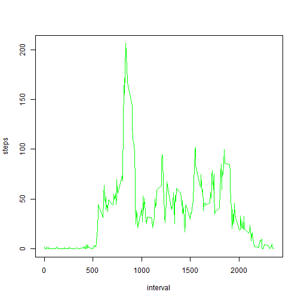

## Loading and preprocessing the data
First we need to uncompress the data and after we'll convert the date string to a real date


```r
library("lattice")
Sys.setlocale("LC_ALL", "English")
```

```
## [1] "LC_COLLATE=English_United States.1252;LC_CTYPE=English_United States.1252;LC_MONETARY=English_United States.1252;LC_NUMERIC=C;LC_TIME=English_United States.1252"
```

```r
unzip("activity.zip")
activity <- read.csv("activity.csv")
activity$date <- as.Date(activity$date)
```


## What is mean total number of steps taken per day?
In this step, I'll get only the data without NAs:

```r
activityClean <- na.omit(activity) 
stepsByDay <- aggregate(
  activityClean$steps, 
  by    = list(activityClean$date), 
  FUN   = sum)
names(stepsByDay) <- c("Date", "Steps")
hist(stepsByDay$Steps, breaks = 10, xlab="Total Number of Steps Taken per Day",col="green")
```

 
The mean steps and the median steps taken by day:

```r
meanByDay <- mean(stepsByDay$Steps)
meanByDay
```

```
## [1] 10766.19
```

```r
medianByDay <- median(stepsByDay$Steps)
medianByDay
```

```
## [1] 10765
```
## What is the average daily activity pattern?

```r
stepsInterval <- aggregate(activity$steps, 
                                by = list(interval = activity$interval),
                                FUN = mean, na.rm = TRUE)

colnames(stepsInterval) <- c("interval", "steps")
plot(stepsInterval, type = "l", col="green")
```

 
The 5-minute interval, on average across all the days in the activity that contains the maximum number of steps is:

```r
maxInterval <- stepsInterval[which.max(stepsInterval$steps),]
maxInterval
```

```
##     interval    steps
## 104      835 206.1698
```

## Imputing missing values
The total number of missing values in the activity (i.e. the total number of rows with NAs) is given by:

```r
totalNas <- sum(is.na(activity))
totalNas
```

```
## [1] 2304
```

Devising a strategy to fill missing values, we can use this way:

```r
activityImputed <- NULL
activityMissing <- activity[is.na(activity$steps), ]

for(i in 1:nrow(activityMissing)) {
  row <- activityMissing[i,]
  row$steps <- stepsInterval[stepsInterval$interval == row$interval, ]$steps[1]
  activityImputed <<- rbind(row, activityImputed)
}
```

Creating a new activity that is equal to the original activity but with the missing data filled in, we have:


```r
activityImputed <- rbind(activityImputed, activity[!is.na(activity$steps), ])
dailySteps <- aggregate(activityImputed$steps,by=list(activityImputed$date),sum,na.rm=TRUE)
names(dailySteps) <- c("Day", "Steps")
```


Making a histogram of the total number of steps taken each day and Calculate and report the mean and median total number of steps taken per day:

```r
hist(dailySteps$Steps)
```

 


## Are there differences in activity patterns between weekdays and weekends?

Comparing weekdays with weekends, we have the following:

```r
activityImputed$day <- weekdays(activityImputed$date)
activityImputed$dayType <- c("weekday")

# If day is Saturday or Sunday, make day_type as weekend
for (i in 1:nrow(activityImputed)){
  if (activityImputed$day[i] == "Saturday" || activityImputed$day[i] == "Sunday"){
    activityImputed$dayType[i] <- "weekend"
  }
}
activityImputed$dayType <- as.factor(activityImputed$dayType)

dailySteps2 = aggregate(steps ~ interval + dayType, activityImputed, mean)
xyplot(steps ~ interval | factor(dayType), data = dailySteps2, aspect = 1/2, type = "l")
```

 

